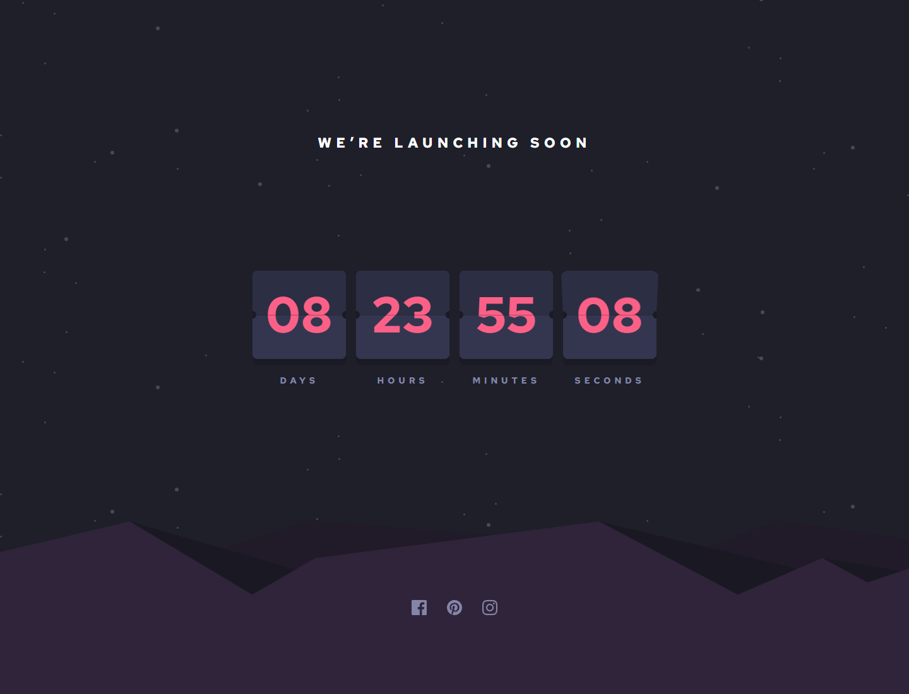

# Frontend Mentor - Launch countdown timer solution

This is a solution to the [Launch countdown timer challenge on Frontend Mentor](https://www.frontendmentor.io/challenges/launch-countdown-timer-N0XkGfyz-). Frontend Mentor challenges help you improve your coding skills by building realistic projects.

## Table of contents

- [Overview](#overview)
  - [The challenge](#the-challenge)
  - [Screenshot](#screenshot)
  - [Links](#links)
- [My process](#my-process)
  - [Built with](#built-with)
  - [What I learned](#what-i-learned)
  - [Continued development](#continued-development)
  - [Useful resources](#useful-resources)
- [Author](#author)

**Note: Delete this note and update the table of contents based on what sections you keep.**

## Overview

### The challenge

Users should be able to:

- See hover states for all interactive elements on the page
- See a live countdown timer that ticks down every second (start the count at 14 days)
- **Bonus**: When a number changes, make the card flip from the middle

### Screenshot



### Links

- Solution URL: [https://github.com/miranlegin/fem-launch-countdown-timer](https://github.com/miranlegin/fem-launch-countdown-timer)
- Live Site URL: [https://frontend-mentor-challenge16.netlify.app/](https://frontend-mentor-challenge16.netlify.app/)

## My process

### Built with

- Assemble static site generator, could have been plain HTML instead
- SCSS
- CSS Animations
- Vanilla JS for flipping logic

### What I learned

I've learned that when working with Date object in Javascript and seconds in particular i can use interval shorter than one second.

```js
setInterval(calculateTime, 325);
```

Workaround would be to ping the current date just on page load and later set interval for exactly one second and run the animation exactly in time.

### Continued development

I would love to hear other opinions how this functionality can be solved because right now i have slight delay between some of the flips depending when the interval kicks in.

### Useful resources

- [Web Dev Simplified Flip Timer Logic](https://www.youtube.com/watch?v=p_6IuhmBsfc) - I've used logic from this video to calculate when the flip should happen.

## Author

- Frontend Mentor - [@miranlegin](https://www.frontendmentor.io/profile/miranlegin)
